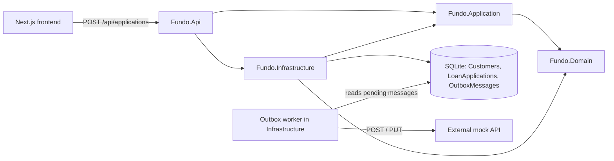

# Architecture

## System overview



Three processes run locally: the Next.js frontend, the ASP.NET Core API (which also hosts the outbox worker) and a standalone mock of the external service.

## Dependency direction

```text
Domain          → nothing
Application     → Domain
Infrastructure  → Application, Domain
Api             → Application, Infrastructure
```

The solution uses a small inward-dependency structure rather than a framework-heavy Clean Architecture implementation. Business rules never depend on EF Core, HTTP or ASP.NET Core; Infrastructure implements the interfaces that Application defines, and Api is the composition root that wires them together.

| Project | Responsibility |
| --- | --- |
| `backend/src/Fundo.Domain` | `Customer`, `LoanApplication` and the `Ssn` value object, with their invariants |
| `backend/src/Fundo.Application` | Rule engine and rules, `SubmitApplicationHandler`, repository, unit of work and event publisher abstractions, the approved event contract |
| `backend/src/Fundo.Infrastructure` | EF Core with SQLite, repositories, unit of work, configured blacklist, transactional outbox, background worker, external HTTP client |
| `backend/src/Fundo.Api` | HTTP contract and input validation, runtime dependency injection, CORS, migrations at startup. The controller is thin |
| `frontend` | Loan form, client side validation for UX, approved and denied pages, direct browser call to the API |
| `external-service/Fundo.ExternalApi` | Standalone mock: idempotent create, update of an existing customer, safe diagnostic listing. Stored in memory |

## Request flow

1. The frontend posts the application to `POST /api/applications`.
2. The API validates the input shape: required fields, a two letter state code, an SSN with nine ASCII digits and an amount greater than zero. Invalid input returns `400` and never reaches the handler.
3. `SubmitApplicationHandler` builds the canonical `Ssn` and runs the rule engine.
4. If a rule denies the application, the handler returns the denial immediately. No repository, outbox or database call is made.
5. If it is approved, the handler finds the customer by SSN, creates or updates the customer and the loan application, stages an `ApplicationApprovedEvent` and calls `SaveChangesAsync` once.
6. The API returns `200` for both decisions: `{ isApproved, applicationId, denialReason }`. A denial is a valid business result, not a transport error.
7. The background worker later delivers the event to the external service, outside the original HTTP request.

## Rule engine

- `IApplicationRule` has a single method, `RuleResult Evaluate(ApplicationRuleContext context)`.
- `ApplicationRuleContext` carries only what the rules need: the state (trimmed and uppercased) and the canonical `Ssn`.
- `RuleEngine` receives `IEnumerable<IApplicationRule>`, evaluates the rules in order and returns the first denial. If no rule denies, the application is approved. It does not know any concrete rule.
- `NewYorkRule` denies `NY`. `BlacklistedSsnRule` asks `ISsnBlacklist` whether the SSN is listed. Denial reasons never contain the SSN.

Rules are registered in `Fundo.Api/Program.cs` in this order: `NewYorkRule`, then `BlacklistedSsnRule`. Because the first denial wins, an application from NY with a blacklisted SSN reports the NY reason. The order only changes which reason is shown, never the decision.

### Adding a rule

Create a class that implements `IApplicationRule` and register it:

```csharp
public sealed class MinimumAmountRule : IApplicationRule
{
    public RuleResult Evaluate(ApplicationRuleContext context)
    {
        // Return RuleResult.Deny("reason") to deny, or RuleResult.Pass() to let the next rule decide.
        return RuleResult.Pass();
    }
}
```

```csharp
builder.Services.AddSingleton<IApplicationRule, MinimumAmountRule>();
```

No changes to `RuleEngine` or to the existing rules are required. If a new rule needs data that the context does not carry yet, extend `ApplicationRuleContext` and the place that builds it. `RuleEngine` and the existing rule classes remain unchanged.

## Returning customer

The SSN is the business identity used to find a returning customer. The `Ssn` value object turns any accepted input into nine ASCII digits, so `123-45-6789`, `123 45 6789` and `123456789` are the same SSN. The canonical value is used for the lookup, the uniqueness constraint and the blacklist.

For the same canonical SSN the handler reuses the same `Customer` and the same `LoanApplication`, and the latest submission replaces the editable data (profile and requested amount). The SSN and the ids never change. The database enforces the same rule with unique indexes on `Customers.Ssn` and `LoanApplications.CustomerId`, and a foreign key from the application to the customer. If a customer exists without an application, the handler fails instead of silently creating a second one.

## Transactional unit and outbox

The customer changes, the loan application changes and the outbox message are all tracked by the same scoped `FundoDbContext` and persisted by one `SaveChangesAsync` call, which EF Core runs in a single database transaction. If any SQL operation in that call fails, none of the new customer, application or outbox changes are committed. This is covered by tests against real SQLite.

`IApplicationEventPublisher.Publish` does not make an HTTP call. Its implementation adds an `OutboxMessage` to the current `DbContext`, so the event intent is part of the same local transaction. SQLite and an HTTP call cannot share one ACID transaction, so the intent is persisted first and delivered later.

Each `OutboxMessage` stores an autoincrement `Id`, `CustomerId`, `EventType`, `Operation` (`Create` or `Update`, as text), the JSON `Payload`, `CreatedAtUtc`, `ProcessedAtUtc`, `RetryCount` and `LastError`. The payload is a snapshot of the approved data, so the worker sends what was committed with that submission rather than whatever the customer looks like later.

## Background delivery

`OutboxBackgroundService` polls every 2 seconds. On each pass it creates a scope and runs `OutboxProcessor`, which:

1. reads the messages with `ProcessedAtUtc` null, ordered by `Id`;
2. sends each one with `ExternalApplicationClient` (HTTP timeout of 10 seconds);
3. on success sets `ProcessedAtUtc`, clears `Payload` and `LastError`, and keeps `RetryCount` as history;
4. on failure increments `RetryCount`, stores a generic `LastError` and keeps the payload;
5. saves after each message, which keeps the window for duplicate deliveries small.

Failures only ever store controlled messages such as `External service returned HTTP 500.` or `Invalid outbox payload.`, never exception text, response bodies or payload data. Cancellation from host shutdown is propagated and is not counted as a failure. An unexpected error aborts the current pass; the hosted service logs a generic message and tries again on the next pass.

**Ordering.** Messages are processed in `Id` order. When a message fails, later messages of the same customer are skipped for the rest of the pass, so an `Update` is never delivered before its `Create`. Other customers keep being processed. If a payload's customer does not match the message metadata, both customers are blocked for that pass.

> For this SQLite implementation, the autoincrementing Outbox Id provides a stable persisted insertion sequence suitable for ordered processing. This assumption is database-specific and would need reevaluation with a different database engine.

A permanently failing or malformed message remains pending and blocks later messages for the same customer, while other customers continue processing.

## External HTTP contract

| Event | Request |
| --- | --- |
| New customer (`Create`) | `POST /api/customers` |
| Returning customer (`Update`) | `PUT /api/customers/{customerId}` |

The JSON body contains `customerId`, `applicationId`, `firstName`, `lastName`, `address`, `state`, `companyName`, `ssn` and `requestedAmount`. The operation is expressed by the HTTP method, not by a field. The SSN never appears in the URL.

Delivery is at-least-once, not exactly-once: the HTTP call can succeed and then the update that marks the message as processed can fail, so the same message is sent again on a later pass. The mock tolerates this. A repeated identical `POST` returns `200` without creating a duplicate, a `POST` with different data for an existing customer returns `409`, and `PUT` replaces the stored record, so repeating it is harmless. `PUT` for an unknown customer returns `404`.

## Testing strategy

| Project | Covers |
| --- | --- |
| `Fundo.Domain.Tests` | `Ssn` normalization and equality, `Customer` and `LoanApplication` invariants and updates |
| `Fundo.Application.Tests` | Rule engine order, short circuit and extensibility, each rule, handler orchestration for new, returning and denied submissions |
| `Fundo.Infrastructure.Tests` | With real SQLite: migrations, repositories, constraints, transactional rollback, outbox staging, worker ordering, blocking and retries, external HTTP client, DI registration |
| `Fundo.Api.Tests` | `WebApplicationFactory` with real DI and a temporary SQLite file: approved, NY, blacklist, returning customer, validation, CORS, migrations, OpenAPI |

Tests use small handwritten fakes instead of a mocking library. The frontend has no automated test suite.

## Trade-offs

- **Address and State are stored separately.** The challenge describes the address as including the state, but the state is a structured input to an eligibility rule, and parsing `NY` out of free text would be fragile. The API accepts only two letter codes, so `New York` cannot bypass the rule. The form presents both fields in one address section.
- **`RequestedAmount` is stored as TEXT.** EF Core maps `decimal` to TEXT in SQLite, which round-trips the exact value. SQLite cannot translate every decimal comparison or ordering, but the amount is only stored, updated and read, never filtered or sorted in SQL.
- **At-least-once delivery** with an idempotent external mock, as described above.
- **Migrations run automatically at API startup** so the project runs without any database setup. Production systems usually apply migrations as a deployment step. `fundo.db` is created relative to the directory from which the API process is started.
- **PII in the outbox.** PII remains in the Outbox payload only until the message is delivered successfully. The SSN is also stored in canonical form in SQLite because it is needed for lookup and uniqueness. A production system handling real SSNs would require stronger PII controls, encryption and key management, access controls, auditing and a defined retention policy. Commands and events hide the SSN in their `ToString()` as an extra safety net, and nothing logs payloads or request bodies.
- **Single backend instance.** The worker assumes one API instance. There is no message claiming, lease or distributed lock; running several instances would require revisiting concurrency, message ownership and ordering.
- **No retry limit.** There is no maximum retry count or dead-letter queue; a failing message is retried every pass and only blocks its own customer. This keeps the take-home small.
- **Concurrent first submissions with the same SSN** are protected by the unique index. The losing request fails with a generic `500` instead of a specific response, because not every database error means a duplicate.
- **Local traffic uses HTTP** on ports 3000, 5176 and 5180 to avoid certificate setup. A deployed system would terminate TLS appropriately.
- **Approved and denied URLs.** Result pages are presentation routes, not the authoritative source of the eligibility decision. The backend API response is the source of truth. The application id and the denial reason travel in the query string for display only; the approved page shows the reference only when it is a valid GUID, and editing a URL never changes data.
- **Frontend validation is for UX only.** The backend validation is authoritative, and the NY and blacklist rules exist only in the backend.
- **Configured blacklist.** The blacklist is loaded from `appsettings.json` into memory, with no table or management endpoints. An invalid configured SSN stops startup; if `Blacklist:Ssns` is missing, the API starts with an empty blacklist.

## Not included

These were left out because they do not earn their complexity for the stated take-home requirements:

- authentication and authorization;
- Docker and CI/CD;
- multi-instance outbox processing;
- retry backoff and a dead-letter queue;
- local HTTPS;
- PII encryption and key management;
- a message broker;
- generic repositories, CQRS or mediator frameworks;
- a frontend test framework.
